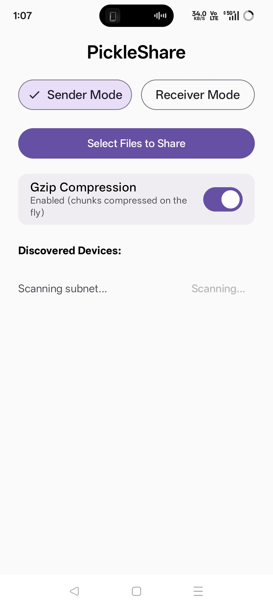
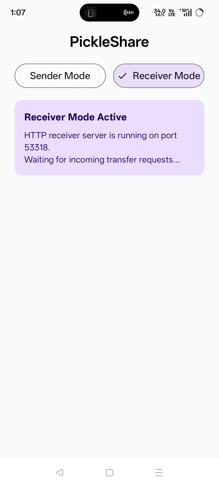
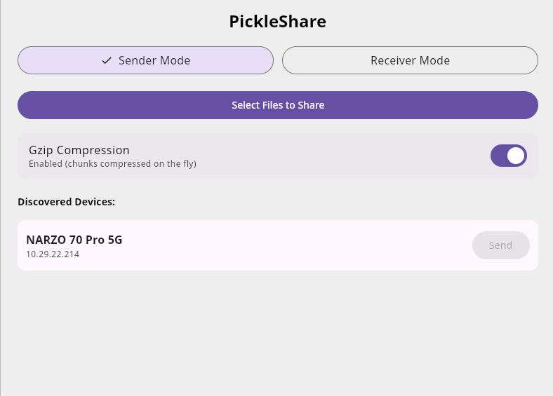
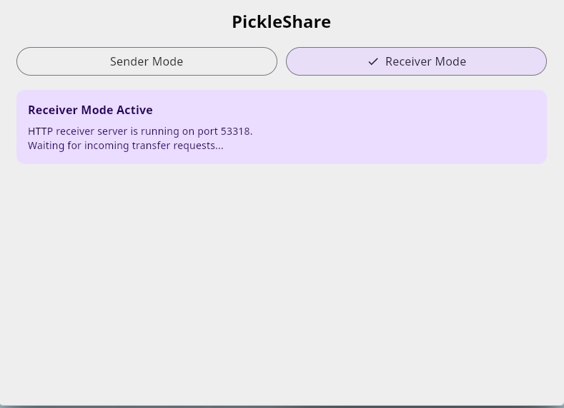
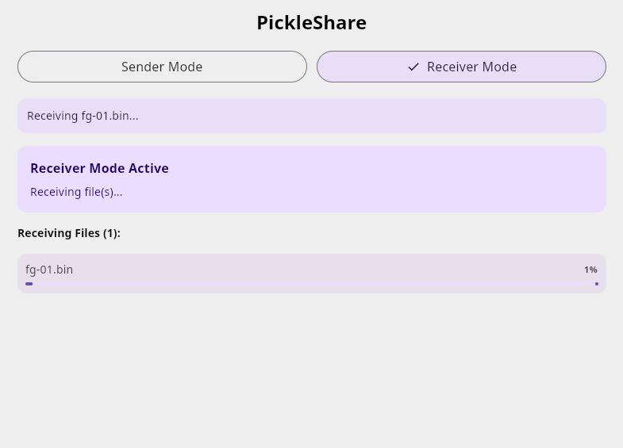
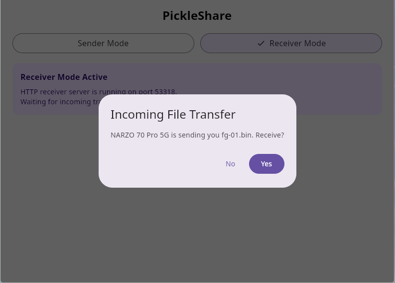

# PickleShare Multiplatform

A LocalSend-style peer-to-peer local network file sharing application built with Kotlin Multiplatform and Compose Multiplatform.

> **Status:** Work in Progress. Android and Desktop (JVM) targets are fully functional for peer discovery and file transfers. iOS support is partially configured in build files but networking logic is currently stubbed. Transfers are currently unencrypted, so use on trusted networks only.

## Screenshots

| Android - Sender Mode | Android - Receiver Prompt |
| :---: | :---: |
|  |  |

| Desktop - Device Discovered | Desktop - Receiver Mode |
| :---: | :---: |
|  |  |

| Desktop - Incoming Transfer Prompt | Desktop - Transfer Complete |
| :---: | :---: |
|  |  |

## Features

- [x] P2P local network device discovery via UDP multicast and broadcast (`224.0.0.167:53317`).
- [x] Direct UDP reply handshake and active peer pruning (>10 seconds timeout).
- [x] Subnet IP scanner for environments with restricted UDP multicast (probes TCP `/api/info` on port `53318`).
- [x] HTTP-based file transfer server and client running on TCP port `53318`.
- [x] Transfer request prompts with accept/deny user confirmation.
- [x] Multi-file selection and chunked streaming with real-time per-file and overall progress tracking.
- [x] Optional on-the-fly Gzip compression for network transfers.
- [x] Unified Material 3 Compose UI across supported platforms.
- [x] Cross-platform file picking integrated via FileKit.
- [x] Automatic download destination management (`Downloads/PickleShare`).
- [x] Active transfer safeguards when switching modes.
- [ ] Native iOS networking engine (discovery and transfer).
- [ ] End-to-end TLS/HTTPS encryption.
- [ ] Text and clipboard sharing.
- [ ] Directory / folder transfer support.

## Tech Stack

| Layer | Technology |
|---|---|
| Language | Kotlin 2.4.20 |
| UI Framework | Compose Multiplatform 1.12.1 with Material 3 1.12.0-alpha03 |
| Architecture | MVVM with `androidx.lifecycle` ViewModel, StateFlow, and Coroutines 1.11.0 |
| Dependency Injection | Koin 4.2.2 (`koin-core`, `koin-compose`, `koin-compose-viewmodel`, `koin-android`) |
| Serialization | Kotlinx Serialization JSON 1.11.0 |
| File Picker | FileKit 0.16.0 (`filekit-core`, `filekit-dialogs`) |
| Networking | JVM Sockets (`DatagramSocket`, `MulticastSocket`, `ServerSocket`, `HttpURLConnection`) |
| Compression | Java GZIP Streams (`GZIPInputStream` / `GZIPOutputStream`) |
| Build System | Gradle with Android Gradle Plugin 9.1.1 and Kotlin Multiplatform plugin |

## Architecture

```
PickleShareMultiplatform/
├── androidApp/          # Android entry point and Application class
│   └── src/main/
│       ├── AndroidManifest.xml
│       └── kotlin/com/yash/multipickle/
│           ├── MainActivity.kt
│           └── PickleShareApplication.kt
├── desktopApp/          # Desktop JVM entry point and native package config
│   └── src/main/
│       ├── kotlin/com/yash/multipickle/main.kt
│       └── installer-resources/
├── iosApp/              # iOS SwiftUI entry point and Xcode project
│   └── iosApp/
│       ├── iOSApp.swift
│       └── ContentView.swift
└── shared/              # Shared KMP library (UI, domain, and platform adapters)
    └── src/
        ├── commonMain/  # Common UI, ViewModel, Koin DI, domain logic, and expect interfaces
        │   └── kotlin/com/yash/multipickle/
        │       ├── App.kt
        │       ├── core/
        │       │   ├── di/appModule.kt
        │       │   ├── permissionchecker/
        │       │   ├── storage/FileDestinationManager.kt
        │       │   ├── transfer/ (FileTransferServer, FileTransferClient, TransferModels)
        │       │   └── udp/ (UdpBroadcastManager, Peer, PacketData)
        │       └── ui/ (MainScreen.kt, MainViewModel.kt)
        ├── androidMain/ # Android actual implementations (sockets, context, storage path)
        ├── jvmMain/     # Desktop JVM actual implementations (sockets, home dir storage)
        └── iosMain/     # iOS stubbed implementations
```

### Shared Code vs Platform Code
- **`commonMain`**: Contains shared Compose UI (`MainScreen`), navigation state management (`MainViewModel`), dependency injection (`appModule`), transfer data models (`TransferRequest`, `Peer`), and service interfaces (`UdpBroadcastManager`, `FileTransferServer`, `FileTransferClient`).
- **`androidMain` & `jvmMain`**: Implement platform service interfaces using `expect`/`actual` declarations:
  - `createUdpBroadcastManager()`: Manages UDP multicast/broadcast listeners and unicast subnet probes.
  - `createFileTransferServer()` & `createFileTransferClient()`: Embeds a socket-level HTTP server (`ServerSocket`) and client (`HttpURLConnection`) supporting chunked streaming and Gzip encoding.
  - `createFileDestinationManager()`: Resolves local output directories (`Downloads/PickleShare`).
- **App Modules**: Initialize platform contexts (`PickleContext`, `FileKit`, `startKoin`) and attach the shared `App()` composable to native windows or activity layouts.

## How It Works

### 1. Peer Discovery
- **Multicast UDP Broadcasting:** Each active device sends a JSON payload (`PacketData`) to `224.0.0.167:53317` once per second, broadcasting its name, app ID, and mode (`wannaSend`).
- **Direct Unicast Reply:** Upon receiving an announcement packet on port `53317`, listening devices respond with a direct UDP packet back to the sender's IP address.
- **Active Peer Tracking:** Devices keep track of discovered peers in a thread-safe map and prune any peer that has not been seen for over 10 seconds.
- **Subnet Probe Fallback:** If multicast is disabled on the network router, an automated background scanner sends direct UDP unicast pings across local IPv4 addresses and probes TCP port `53318` via `GET /api/info`.

### 2. Handshake Protocol
1. The sender transmits a JSON `TransferRequest` (containing device model, alias, and file metadata) via `POST http://<target-ip>:53318/api/transfer/request`.
2. The receiver triggers an `AlertDialog` prompt in the UI ("<Sender> is sending you <Files>. Receive?").
3. The HTTP request is held open until the user accepts or denies the transfer.
4. If accepted, the server returns `200 OK` with `{"status":"accepted"}`. If denied, it returns `403 Forbidden`.

### 3. File Transfer
1. After receiving an acceptance response, the client uploads each file to `POST http://<target-ip>:53318/api/transfer/upload?fileName=<encoded-name>`.
2. Data is streamed in 64KB chunks (`CHUNK_SIZE`). If Gzip compression is enabled in the UI, streams are compressed on-the-fly using `GZIPOutputStream` and decompressed via `GZIPInputStream`.
3. Progress listeners track individual file completion percentages and calculate overall batch progress.
4. Received files are saved to the local `Downloads/PickleShare` directory.

## Security

> **Transfers are not encrypted.** File data and transfer metadata (device name, file names, sizes) are sent over plain HTTP on TCP port `53318`, and discovery packets are plain UDP on `53317`. Anyone on the same network can read or tamper with them.

- Use PickleShare only on networks you trust, such as your home Wi-Fi. Avoid public, hotel, or shared networks.
- Every incoming transfer requires explicit accept/deny confirmation on the receiving device.
- Devices are not authenticated, so a peer's displayed name can be spoofed. Check the name and files in the prompt before accepting.
- TLS/HTTPS encryption is planned (see Roadmap).

## Getting Started

### Prerequisites
- JDK 17 or higher
- Android Studio Ladybug or newer / IntelliJ IDEA
- Android SDK (compileSdk 37, minSdk 24)

### Clone Repository
```bash
git clone https://github.com/unknownfanatic/PickleShare-Multiplatform.git
cd PickleShareMultiplatform
```

### Build & Run Commands

#### Android App
Build debug APK:
```bash
./gradlew :androidApp:assembleDebug
```
Install and launch on connected device/emulator:
```bash
./gradlew :androidApp:installDebug
```

#### Desktop App (JVM)
Run desktop application:
```bash
./gradlew :desktopApp:run
```
Run with hot reload:
```bash
./gradlew :desktopApp:hotRun --auto
```
Package native desktop distribution (Debian, DMG, or MSI depending on host OS):
```bash
./gradlew :desktopApp:packageDistributionForCurrentOS
```

#### Running Tests
Run JVM tests:
```bash
./gradlew :shared:jvmTest
```
Run Android host unit tests:
```bash
./gradlew :shared:testAndroidHostTest
```

### Troubleshooting

- **Devices not finding each other:**
  - Verify that both devices are connected to the same Wi-Fi network.
  - Check whether **AP Isolation / Client Isolation** is enabled on the Wi-Fi router (common on public or guest networks), as this blocks device-to-device traffic.
  - Click the **Scan Subnet** button in the app to trigger direct TCP/UDP unicast probing across local IP addresses.
- **Linux Firewall:**
  - If running on Linux, ensure UDP port `53317` and TCP port `53318` are open in your firewall configuration:
    ```bash
    sudo ufw allow 53317/udp
    sudo ufw allow 53318/tcp
    ```

## Platform Support

| Platform | Build Target | Discovery Status | Transfer Status | Notes |
|---|---|---|---|---|
| Android | `:androidApp` | Supported | Supported | `minSdk 24`, `targetSdk 37`. Tested on physical devices and emulators. |
| Desktop (Linux, macOS, Windows) | `:desktopApp` | Supported | Supported | JVM target. Native packages (`.deb`, `.dmg`, `.msi`) supported. |
| iOS | `:shared` (`iosArm64`, `iosSimulatorArm64`) | Not Implemented | Not Implemented | Xcode project in `iosApp/`; network services currently return stubbed responses. |

## Roadmap

- [ ] Native iOS UDP multicast discovery and HTTP file transfer implementation.
- [ ] End-to-end TLS/HTTPS encryption with certificate pinning or fingerprint verification for transfers.
- [ ] Text snippet and clipboard sharing support.
- [ ] Folder hierarchy and batch directory transfers.
- [ ] Android background service implementation for background file transfers.

## Author

- **Yogendra Saini** - [https://github.com/unknownfanatic](https://github.com/unknownfanatic)
